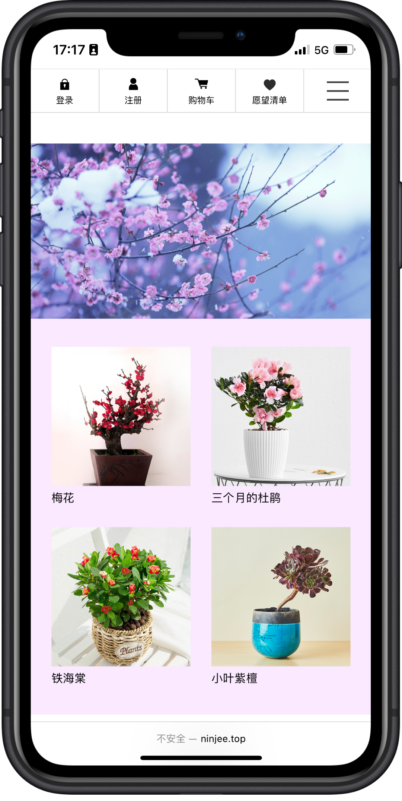
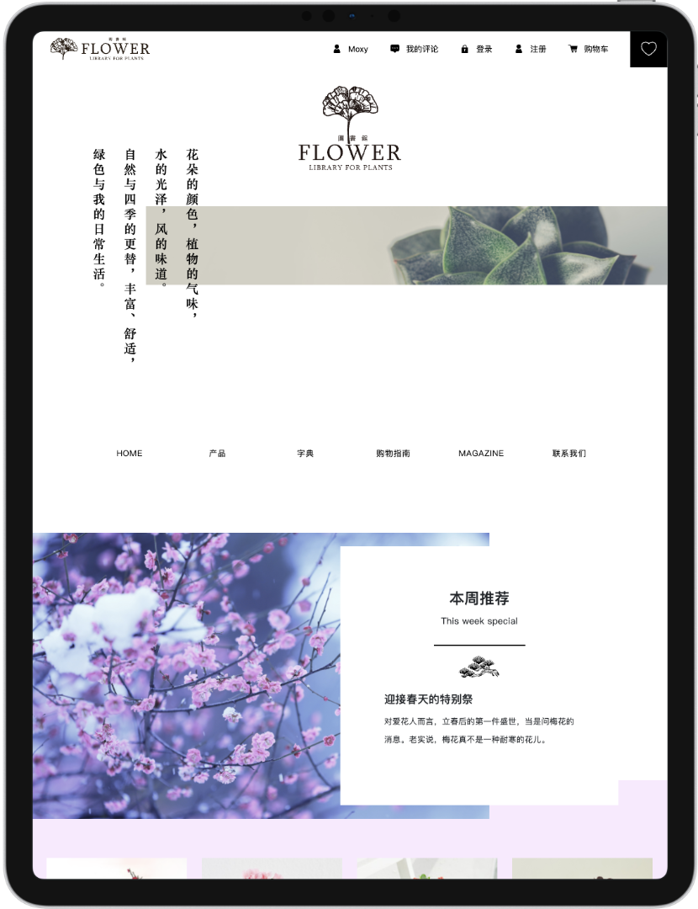
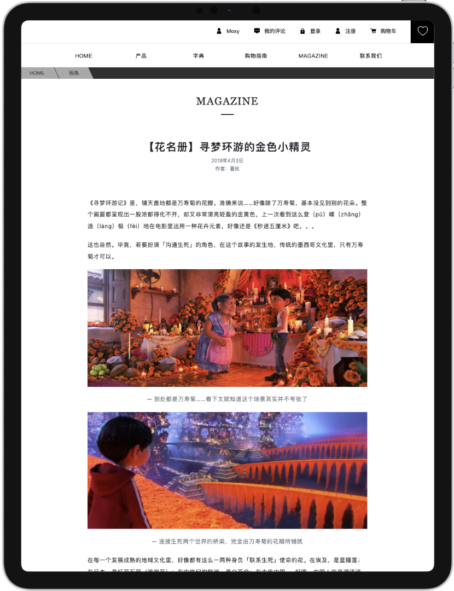

## 🌸 Flower Library 

### 🌵 鲜花图书馆 

- [FlowerLibrary](https://github.com/MoxyNJ/FlowerLibrary/tree/master/FlowerLibrary)：是项目的静态网页，删除了 Asp 和 SQL Server 相关代码。

- [FlowerLibrary_org](https://github.com/MoxyNJ/FlowerLibrary/tree/master/FlowerLibrary_org)：是项目的原始文件，前端采用 Asp，后端采用 SQL Server 数据库。

### 移动手机端：

### 移动平板端：

### 电脑端：

